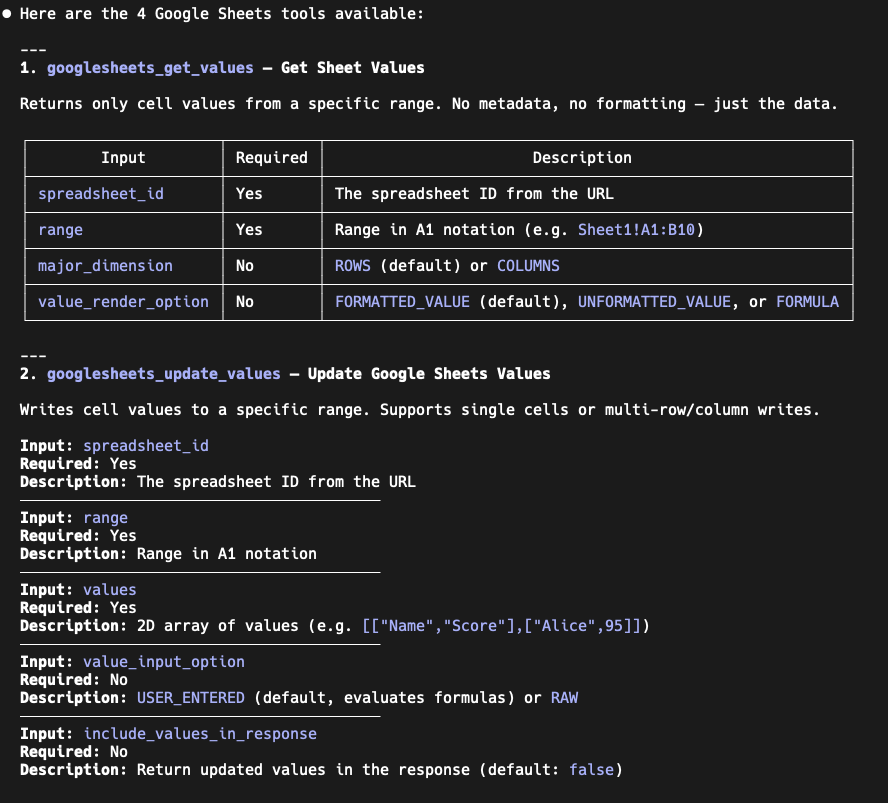
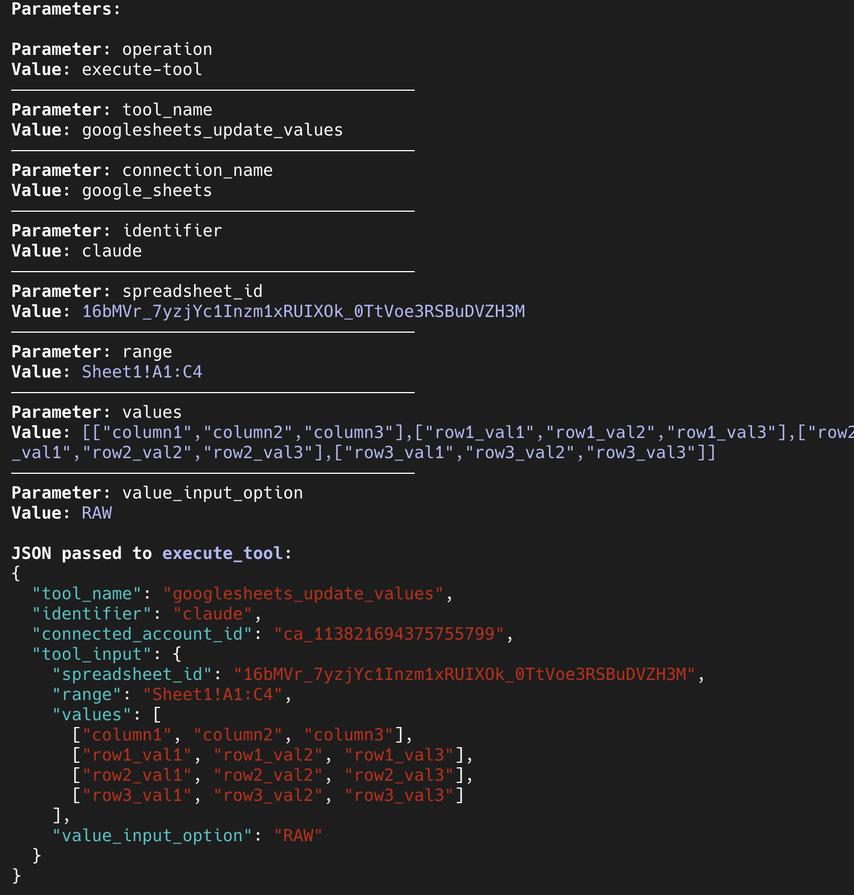

# scalekit-actions-skill

Rapidly add Scalekit tools to your app — directly from Claude Code.

Install this skill and ask Claude in plain English to execute any Scalekit Connect tool. Claude handles the auth flow, calls the tool, and returns structured output you can use to build and test workflows — all without leaving your editor.

## Get started

**1. Install the plugin**
```
/plugin marketplace add scalekit-inc/scalekit-actions-skill
/plugin install scalekit-actions-skill@scalekit-inc
```

**2. Add your credentials to `.env`**
```
TOOL_ENV_URL=https://your-env.scalekit.dev
TOOL_CLIENT_ID=skc_your_client_id
TOOL_CLIENT_SECRET=your_client_secret
```

**3. Just ask**

Open Claude Code and ask it to execute any Scalekit tool, generate an auth link, or build a workflow. The skill handles the rest.

## Example

Ask Claude in natural language — it discovers the available tools and picks the right one:


Claude explores the tool schema to understand inputs and requirements:



Then executes the tool and returns structured parameters along with the exact JSON passed to `execute_tool` — ready to copy into your code:


